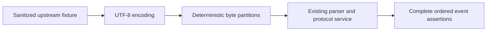

# Agent Note: Preserve quota-backed discovery and verify byte-partition streaming

Status: proposed

Design status: superseded by the finalized Schema work package; not authorized for implementation.

The [Schema conversion and reporting decision](2026-10-08-schema-conversion-and-degradation-reporting.md) supersedes this plan. The quota-backed discovery constraint remains in force. Stream byte-partition work is not the selected implementation scope; the original text below is retained only as an unimplemented historical proposal.

This proposal targets the current gateway's stream verification boundaries. No production behavior has been changed.

## Problem

Antigravity Manager already implements account selection, quota policies, dynamic model listing, forwarding, protocol conversion and request auditing. Verification improvements must preserve the product's existing model discovery policy.

The product requirement is to retain the current filtering of upstream descriptors without `quotaInfo`. A descriptor without quota evidence will not be added to public discovery or treated as a new eligible account/model candidate. Missing quota metadata is not proof of upstream denial, but the application may deliberately require quota evidence before expanding its supported discovery surface.

`GoogleAPIService.toModelQuotaInfo()` filters descriptors without `quotaInfo`. Under this requirement, that filter is intentional and will remain unchanged. The existing public presets, raw quota mode and alias contracts will also remain unchanged; this proposal does not claim that every currently listed model has positive quota.

The remaining improvement is verification: reviewed stream tests cover parsing, malformed input and timeouts, but do not establish systematic equivalence across actual UTF-8 byte partitions of the same upstream fixture. This is a test coverage gap, not a confirmed production parser defect.

Relevant owners are [GoogleAPIService](../../../../src/modules/cloud-account/services/GoogleAPIService.ts), [account model policy](../../../../src/modules/proxy-gateway/server/modules/account-lease/policies/account-lease-model.policy.ts), [model mapping](../../../../src/modules/proxy-gateway/antigravity/ModelMapping.ts) and [the existing real-path harness](../../../../src/tests/unit/proxy-real-path.harness.ts). The [implemented quota and Flash routing decision](../../implemented/bug-fix/2026-10-05-explicit-quota-and-flash-routes.md) remains authoritative.

## Proposal

### Scope

Implementation will add stream-partition tests for the gateway's parser, protocol services and transport boundary.

It will preserve quota filtering, model lists, registered generation tuples, account eligibility, fallback rules, authentication, durable formats and refresh ownership. There will be no independent catalog snapshot, new persistence field, database migration, background polling, capability inference or automatic probe for models without quota evidence.

If a test demonstrates a defect, the implementation will make the smallest correction justified by that case. It will not rewrite working stream logic in anticipation of an unobserved failure.

### Quota evidence semantics

| Evidence                       | Meaning                                                                                  | Requirement for this proposal                          |
| ------------------------------ | ---------------------------------------------------------------------------------------- | ------------------------------------------------------ |
| Descriptor without `quotaInfo` | No usable quota record from this response; provider entitlement is not proven either way | Keep the current descriptor filter                     |
| Explicit zero quota            | Reported remaining quota is zero                                                         | Preserve existing quota exhaustion and recovery policy |
| Valid positive quota           | Quota evidence exists; other account and routing constraints still apply                 | Preserve existing scheduling                           |
| Static preset or public alias  | Existing public contract, not a new entitlement signal                                   | Preserve its existing behavior                         |

These distinctions will prevent a future test or refactor from interpreting missing quota as 100%, fabricating a zero quota entry, or broadening sibling fallback candidates.

### Test data flow



The helper will encode each full fixture before splitting bytes. It will not split a JavaScript string and independently encode its fragments, which can fail to represent real network boundaries inside a multi-byte character.

Short parser fixtures will exercise every two-part byte split and one-byte chunks. Larger protocol fixtures will use delimiter-focused boundaries and reproducible seeded partitions. The helper will not enumerate every possible multi-part composition.

### Verification matrix

| Scenario                                | Partition choices                          | Assertions                                                 |
| --------------------------------------- | ------------------------------------------ | ---------------------------------------------------------- |
| Chinese text and emoji                  | Every two-part split and one-byte chunks   | Exact text and event order, without replacement characters |
| SSE framing and JSON syntax             | CRLF, newlines, colons, braces and escapes | Equivalent decoded events and payloads                     |
| Thinking/text transitions               | Each transition boundary                   | Identical block order, indexes and closes                  |
| Multiple tool calls                     | IDs, names, escaped JSON arguments         | Identical calls and arguments, without loss or duplication |
| Usage and terminal frames               | Delimiters and terminal markers            | Identical usage and exactly one terminal sequence          |
| Error, malformed JSON and premature EOF | Targeted boundaries                        | Existing failure policy and no false successful completion |
| Multiple events in one chunk            | Whole fixture and seeded partitions        | Same observable events as fragmented input                 |
| Abort and downstream close              | Before readiness and during output         | Listener, timer and stream cleanup                         |

Tests will compare complete observable events, including tool arguments, block indexes, usage and finish reasons. They will not compare final text alone.

Time and request IDs will be fixed through existing injection points where possible. Only explicitly identified nondeterministic transport IDs may be normalized. Assertions will not omit behavioral fields to conceal differences.

### Test layers

1. Parser tests will verify UTF-8 decoding, SSE framing and JSON boundaries using real parser code.
2. Protocol-service tests will reuse the existing real-path harness where suitable and exercise OpenAI, Gemini and Anthropic event conversion.
3. At least one transport-boundary test will use the actual `GeminiClient` with mocked HTTP bytes. A mocked protocol upstream alone will not establish Axios decoding behavior.

The planned locations are `src/tests/unit/stream-byte-partition.test.ts` and `src/tests/unit/proxy-stream-partition-parity.test.ts`, plus a small test-only partition helper. Final placement will follow current test ownership and avoid generic production infrastructure.

Anthropic waits for a meaningful first event before returning a ready stream. Tests will start the request and feed that event concurrently, then consume the remaining stream with backpressure. They will not wait for readiness before beginning all input.

### Timeout and retry contracts

Anthropic heartbeat frames will not count as meaningful mapped output. Existing OpenAI/Gemini byte-idle behavior will remain unchanged. The proposal will not unify these distinct timeout contracts.

After content is published, an error must not cause a new retry to replay the content. Error, abort, completion and downstream closure cases will verify resource cleanup and terminal behavior.

Malformed and truncated fixtures will use the existing parser/error policy as their expectation. A characterization result will be reviewed before changing that policy.

### Implementation steps and evidence

| Step | Deliverable                                                   | Exit evidence                                                    |
| ---- | ------------------------------------------------------------- | ---------------------------------------------------------------- |
| 1    | Sanitized fixtures and byte-partition helper                  | Reproducible partitions with no live credentials                 |
| 2    | Parser partition suite                                        | Complete event parity and existing malformed-input tests         |
| 3    | Three protocol-service suites and transport-boundary coverage | Tools, thinking, usage, termination, abort and timeout evidence  |
| 4    | Minimal fixes only if failures demonstrate defects            | A regression case that fails before the fix and passes afterward |

The initial focused regression set will include the existing `internal-sse`, `internal-sse-malformed` and `anthropic-stream-timeout` suites, plus the new owning tests. Additional protocol tests will be selected from [testing guidance](../../../../docs/testing.md) if a production correction touches their behavior.

Changes to shared/public types or module boundaries will additionally run type-check. Documentation and Agent Notes will run formatting and agent-contract checks. Pure test additions do not require live-provider, native keyring, Electron packaging or the full platform matrix.

### Compatibility and observability

This proposal adds no durable data and requires no import/export or rollback migration. Protocol response shapes and event ordering remain external contracts.

Fixtures will contain no real credentials, account email or authorization headers. Existing request and upstream-attempt audit remains the diagnostic owner. No new logging stack or diagnostics endpoint will be added.

### Ordered execution checklist

The following tasks are planned, not completed. Existing user changes will be left untouched. No commit, push, live-provider request or production account access is included.

#### E0. Freeze scope and establish the baseline

- [ ] E0.1 Record the affected stream paths and current worktree status. Preserve `toModelQuotaInfo`, model-list contracts, quota locks, account selection, registered tuples and durable formats.
- [ ] E0.2 Run the existing parser, mapper, timeout, disconnect and four real-path surface suites listed below. Record failures before adding tests and distinguish them from new regressions.
- [ ] E0.3 Locate current cleanup methods and configuration seams for test isolation. Do not add public production exports solely for test access.
- [ ] E0.4 Record protocol expectations for valid completion, malformed input, EOF and cancellation from existing tests and owning code. An incomplete upstream JSON frame is different from a complete response that legitimately closes without an extra terminal marker.

**Deliverable:** baseline results and a small coverage table in the final implementation report. **Gate:** existing failures are diagnosed before related new assertions are interpreted.

#### E1. Define fixtures and expected observable results

- [ ] E1.1 Add `src/tests/unit/stream-byte-partition.fixtures.ts`, using precise current protocol types and existing frame builders. Keep all payloads synthetic and credential-free.
- [ ] E1.2 Define valid cases: Unicode text; thinking then text; two distinct declared tools with escaped Unicode arguments; final usage and completion; and framing with CRLF/comments/multiple frames. Include wrapped and bare envelopes only on paths whose existing contracts support them.
- [ ] E1.3 Define targeted failure cases separately: malformed event followed by a valid event, invalid-event recovery threshold where established, incomplete JSON at EOF, upstream error before output and upstream error after output.
- [ ] E1.4 Give each case a manually reviewed expected result: complete ordered events, full tool arguments, exact usage and terminal status. Baseline-versus-partition equality will supplement this independent oracle; it will not replace it.
- [ ] E1.5 Keep short exhaustive fixtures at or below a proposed 512 bytes and normal service fixtures at or below 8 KiB. These are test-cost targets, not new production limits.

**Deliverable:** fixtures with explicit expected outcomes. **Gate:** an assertion cannot pass solely because the unpartitioned production path has the same defect.

#### E2. Add a test-only byte source and partition runner

- [ ] E2.1 Add `src/tests/unit/stream-byte-partition.harness.ts`. Encode the full fixture once, then slice the resulting bytes without re-encoding fragments.
- [ ] E2.2 Support a whole-buffer control, all two-part splits for short cases, one-byte chunks, targeted delimiter/Unicode splits and four fixed seeds for irregular multi-part splits.
- [ ] E2.3 Extend the existing `createUpstream` in `proxy-real-path.harness.ts` with a typed, mutually exclusive raw-byte source while preserving every current frame-based caller. Construct a fresh readable for every run and do not reuse a consumed stream.
- [ ] E2.4 Verify the byte source reconstructs the original bytes and that intended short-case boundaries reach the service input. Use a buffered/lazy source so Anthropic preflight receives data without an eager-emitter race.
- [ ] E2.5 Collect complete downstream SSE messages independently of Observable emission boundaries. In Gemini passthrough, different `next()` fragment counts are expected; reconstruct messages before comparing them.
- [ ] E2.6 Fix time/IDs through existing test seams, reset available singleton stores using current lifecycle methods, and restore spies, timers and environment after each run. Preserve usage, block indexes and finish reasons in comparisons.

**Deliverable:** a helper used by at least two real service paths. **Gate:** no production decoder is copied into the test helper. `decodeInternalSseData` accepts complete JSON text and does not itself own UTF-8 byte decoding; byte tests must enter the existing service decoder.

#### E3. Exercise all public streaming formats

- [ ] E3.1 Add `src/tests/unit/stream-byte-partition.test.ts` for short exhaustive cases entering actual service byte-decoding paths. Continue to run existing JSON/envelope parser tests.
- [ ] E3.2 Add `src/tests/unit/proxy-stream-partition-parity.test.ts` for the normal-sized matrix through OpenAI Chat Completions, OpenAI Responses, Anthropic Messages and Gemini streaming.
- [ ] E3.3 Verify Unicode, tools, thinking where supported, usage, finish reasons and terminal sequences using the E1 oracle. Protocol differences will have separate expectations; responses from different protocols will not be required to have identical shapes.
- [ ] E3.4 Verify each partition matches its own protocol's whole-buffer control, including framing and no unexpected replay. Gemini callback fragments will not be treated as protocol events.
- [ ] E3.5 For each failure case, preserve established recovery/error behavior and output ordering. If there is no defined expectation, specify and review that case before changing production semantics.
- [ ] E3.6 Keep real services/mappers in the path. Mock accounts, configuration and the upstream byte source, rather than mocking the service being verified.

**Deliverable:** four surface suites with explicit byte coverage. **Gate:** all selected valid cases produce their expected observable results for every selected partition.

#### E4. Verify the actual HTTP boundary

- [ ] E4.1 Add `src/tests/unit/gemini-client-stream-transport.test.ts` with the existing `// @vitest-environment node` convention. Do not change the global happy-dom configuration.
- [ ] E4.2 Use a loopback HTTP server on an ephemeral port as a synthetic upstream proxy, following `upstream-proxy-http.test.ts`. Configure the existing proxy seam in the test and use a synthetic token. The server will answer locally and never forward requests.
- [ ] E4.3 Execute the real `GeminiClient.streamGenerateInternal` and Axios stream transport. Feed Unicode/tool/usage bytes from the loopback server into an actual protocol service or existing decoder path.
- [ ] E4.4 Verify received content, event order and completion. TCP may coalesce server writes, so the socket test will not assert an exact count of received chunks; E2/E3 provide deterministic byte-boundary coverage.
- [ ] E4.5 Exercise a socket close after output and an AbortSignal where the owning public path supports one. Assert the existing public outcome and close server connections in `finally`.
- [ ] E4.6 Restore proxy/configuration/env mocks and close all owned sockets. No real account, endpoint override in production code or external Google request will be required.

**Deliverable:** actual Axios/Node stream evidence. **Gate:** mocking `axios.post` alone is not accepted as proof of this transport path. If loopback sockets cannot run in the environment, report this gate as unverified.

#### E5. Verify timeout, cancellation and resource ownership

- [ ] E5.1 Extend the existing Anthropic timeout and OpenAI disconnect suites rather than duplicating their entire setup.
- [ ] E5.2 Use fake time for first-event and idle cases; preserve the assertions already established for heartbeat and protocol-specific timers. Fast byte-parity cases will not deliberately advance time.
- [ ] E5.3 Test unsubscribe/downstream disconnect after output and cancellation before readiness on the applicable path. Compare owned listener/timer/resource state against its setup baseline instead of requiring unrelated global timers to be absent.
- [ ] E5.4 Assert that errors after published content do not produce a second upstream generation or a replayed start/content sequence. Preserve the existing permitted pre-output retry behavior.
- [ ] E5.5 Confirm a later valid request still works after each abort/error test, so leaked shared state cannot poison subsequent cases.

**Deliverable:** lifecycle evidence with deterministic time. **Gate:** behavior that cannot be exercised through the actual owning interface is identified as unverified rather than tested through a fabricated API.

#### E6. Fix only demonstrated defects and close validation

- [ ] E6.1 For each failure, record fixture ID, partition boundary/seed, protocol, expected event, observed event and whether the failure belongs to the helper or production path.
- [ ] E6.2 Reduce a production failure to one representative case, show it failing before a fix, then change only its owning decoder, mapper or cleanup implementation.
- [ ] E6.3 A parsing fix must preserve quota and routing behavior. A public error/termination semantic change requires an explicit expectation and an update to this decision record.
- [ ] E6.4 If all tests pass without production changes, deliver the test additions and stop. Do not add a speculative rewrite.
- [ ] E6.5 Run the focused suites once after the final relevant edit, then type-check/lint as required by the affected contracts and test typing. Inspect new/changed files for unrelated work and sensitive fixtures.
- [ ] E6.6 Report executed commands, results, coverage limits, production fixes if any and the loopback/live-provider distinction. Update current feature references only if shipped behavior actually changes.

**Deliverable:** reviewable implementation diff and final evidence. **Gate:** no unresolved failure affecting the changed path is hidden by weakened assertions or skipped tests.

### Dependencies, review boundaries and effort

```plaintext
E0 → E1 → E2 → E3 → E4 → E5 → E6
```

Fixtures and the byte helper must be stable before protocol assertions are interpreted. Transport and lifecycle cases will follow basic byte parity so failure diagnosis remains bounded.

| Review slice | Contents                                              | Estimate excluding production fixes |
| ------------ | ----------------------------------------------------- | ----------------------------------- |
| A            | Baseline, fixtures, byte source/helper                | 4-7 engineering hours               |
| B            | Four surface suites and deterministic assertions      | 4-8 engineering hours               |
| C            | Actual HTTP transport, lifecycle and final validation | 5-10 engineering hours              |

The total estimate is 13-25 engineering hours, approximately 2-4 working days for one engineer. It is not a deadline. A newly demonstrated defect or unavailable socket environment will be estimated separately. The slices are review units, not authorization to create commits or pull requests.

### Planned commands

These commands are for implementation, not evidence that the new tests exist or have already run. Use the checked-in npm scripts in a normal project development environment.

Baseline and existing regression set:

```powershell
npm test -- --reporter=dot src/tests/unit/internal-sse.test.ts src/tests/unit/internal-sse-malformed.test.ts src/tests/unit/streaming-state.test.ts src/tests/unit/openai-responses-streaming-mapper.test.ts src/tests/unit/anthropic-stream-timeout.test.ts src/tests/unit/openai-stream-disconnect-lifecycle.test.ts src/tests/unit/proxy-real-path-parity.test.ts src/tests/unit/proxy-real-path-responses.test.ts src/tests/unit/proxy-real-path-anthropic.test.ts src/tests/unit/proxy-real-path-gemini.test.ts
```

New coverage, after those files are created:

```powershell
npm test -- --reporter=dot src/tests/unit/stream-byte-partition.test.ts src/tests/unit/proxy-stream-partition-parity.test.ts src/tests/unit/gemini-client-stream-transport.test.ts
```

Quota/list guard evidence will reuse the existing raw-mode and account-model suites without changing their behavior:

```powershell
npm test -- --reporter=dot src/tests/unit/model-list-raw-mode.test.ts src/tests/unit/account-lease-model-policy.test.ts
```

Final affected-surface gates:

```powershell
npm run type-check
npm run lint
npm run check:governance
npm run format
```

When npm is unavailable, run the exact checked-in script bodies through the available Node runtime and report that substitution. Existing worktree/environment failures will be diagnosed and reported without modifying unrelated files to make the gates pass.

## Alternatives considered

- **Persist a separate model catalog and expose descriptors without quota:** excluded because it does not meet the stated product requirement and introduces unnecessary persistence and routing-adjacent complexity.
- **Remove the missing-quota filter:** rejected because it would expand model discovery without the required quota evidence.
- **Replace account-aware orchestration with a single-provider adapter:** rejected because it cannot satisfy the gateway's account-specific scheduling and protocol contracts.
- **Infer image support or thinking budgets from model names:** rejected because names do not prove executable capabilities.
- **Rewrite stream parsing before adding tests:** rejected because a production defect has not been demonstrated.
- **Check final response text only:** rejected because tool, usage and terminal errors can occur while final text still matches.

## Acceptance criteria

1. Missing-quota filtering and existing public/raw model-list behavior remain unchanged.
2. Account eligibility, explicit zero-quota handling, registered tuples and fallback candidates remain unchanged.
3. OpenAI, Gemini and Anthropic fixtures produce equivalent complete ordered events across the selected actual byte partitions.
4. Unicode, tools, thinking, usage and terminal cases preserve their data without duplication or loss.
5. Timeout, malformed-input and post-publication retry policies retain their established contracts.
6. Abort, error, completion and downstream closure release owned resources.
7. Any production fix has a demonstrated failing regression case and appropriate focused validation.
8. No new dependency, durable field, background polling, sensitive fixture or process-boundary import is introduced.

## Risks

- Deterministic partition coverage applies to the selected fixtures, not every future provider response.
- Service mocks do not establish actual HTTP decoding; transport-boundary coverage must remain distinct.
- Anthropic preflight and stream backpressure can deadlock an incorrectly constructed test harness.
- Uncontrolled time or identifiers can produce false parity failures; normalization must remain narrow.
- Missing quota metadata does not prove upstream denial. The product's conservative filter is a policy choice, not a discovered provider guarantee.
- No live upstream parsing defect has been confirmed. Expected value is stronger verification; runtime changes may prove unnecessary.
