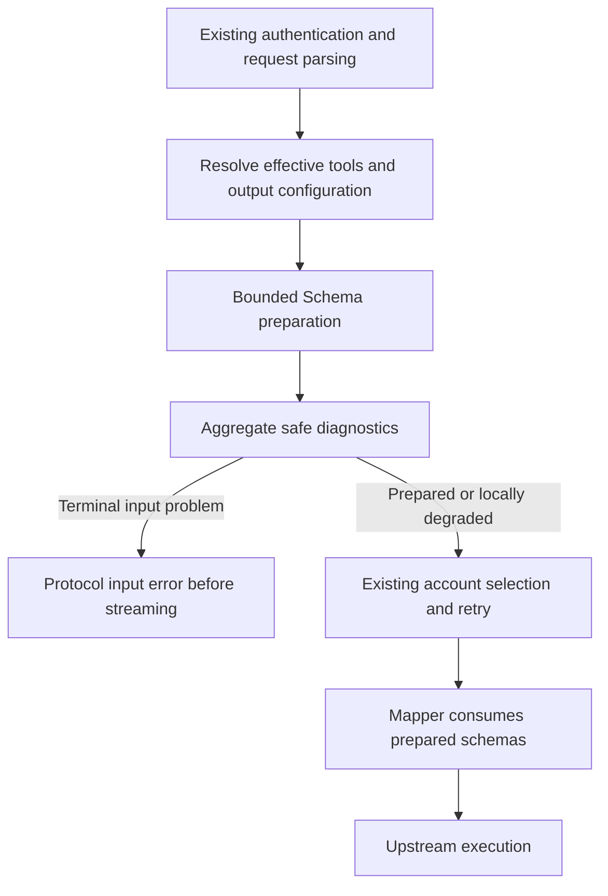

# Agent Note: Resolve Schema references and report tool parameter degradation

Status: proposed

Design status: finalized with the user on 2026-10-08; implementation, real Pro/current Flash tool continuation, configured Claude Code/MCP declaration acceptance and strict remote Sentry storage verification complete. The witnessed parallel-history variants pass. Broader client/budget and packaged Electron coverage remain open.

Acceptance scope confirmed on 2026-10-09: the configured default primary endpoint is sufficient
for this Schema work package. Backup-endpoint failover is supplementary and does not block
scoped completion; failed probes retain their original verdicts. The
[execution record](../../../../artifacts/schema-work-package/verification.md#scoped-completion-and-follow-up-coverage)
owns the completed evidence and follow-up limits. No production routing policy changes.

This note retains the approved proposal and design history. The [current Schema reference](../../../../docs/proxy-schema-conversion.md) describes implemented code behavior and links to separately recorded live acceptance. This supersedes the [stream-verification proposal](2026-10-08-model-discovery-and-stream-verification.md). The user's subsequent request to begin execution authorizes implementation and the scoped acceptance work.

## Problem

The TypeScript gateway needs reliable tool Schema preparation to reduce coding-client failures, tool errors and context loss. The selected work package is Schema conversion; history changes remain a separate validation task.

Before implementation, read-only synthetic calls of the production Schema utility confirmed unresolved nested and escaped references, same-name definition collisions, an external reference incorrectly matched to a local name, and a recursive reference causing a stack overflow. These are utility-boundary findings, not evidence of live-provider failure frequency. The prior [reference expansion](../../../../src/modules/proxy-gateway/antigravity/JsonSchemaUtils.ts) used the final path segment instead of the complete JSON Pointer.

Before this change, OpenAI and Anthropic performed some normalization inside account retry paths, allowing conversion exceptions to reach retry failure handling. Moving only the resolver would not establish correct admission or error classification. Native Gemini copies its tools and generation configuration through a separate path and does not gain this correction automatically.

The [logger](../../../../src/shared/logging/logger.ts) invokes its Sentry reporter only for error-level records while reporting is enabled. Before this change, only [Electron instrumentation](../../../../src/instrument.ts) installed that reporter; the reviewed standalone [core entry point](../../../../src/core/main.ts) did not. A warning alone cannot meet the requirement to record conversion problems in both logs and Sentry.

## Proposal

### Execution evidence on 2026-10-08

Follow-up resolves the three legacy Gemini test failures: routing first normalizes the public
alias, then variant application chooses the physical `gemini-3-flash-agent` or `gemini-pro-agent`
profile. Test expectations now cover that final model consistently in leasing, upstream payloads
and penalties, with the pro thinking budget retained. Production routing and quota policy remain
unchanged. All 97 retry/routing/variant tests pass.

The earlier 972-record candidate set was entirely IPC traffic. The replay bug was a missing
model-traffic/protocol filter before the sample limit. The corrected selector finds no intact
applicable model bodies; retained model payloads are expired. Empty evidence returns exit code 2
and `available: false`; three Node CLI integration cases verify selection and availability.
Controlled Claude Code bare-default sampling now covers three Schema shapes over two requests
and six conversions, with no degradation, successful Read result continuation, and maximum
accounting of 175 nodes / 7,944 bytes. Existing bounds remain appropriate for these limited
samples; broader client/MCP coverage remains open. Subsequent authorized real gateway acceptance
passes ordinary/degraded Pro tools, native Pro continuation and actual Claude Code Read. The
live client uncovers a separate stream final-answer bug, fixed and verified against the real
upstream; its [implemented decision](../../implemented/bug-fix/2026-10-08-claude-stream-final-answer.md)
owns the protocol rationale. The old physical Flash route returns a model-retirement notice;
current `gemini-3.7-flash-high` passes ordinary/degraded OpenAI and native Gemini tool loops.

The local slice now includes bounded reference resolution, Schema admission before retries,
protocol-specific input errors, isolated log/Sentry reporting, Node instrumentation, serialized
preference propagation, WebSocket preflight before state publication and read-only replay.
Successful cache behavior is preserved; degraded results are excluded. Quota/model/account policy
and durable formats were not changed.

The earlier 28-file protocol/runtime run passed 276 tests and exposed three Gemini alias failures,
subsequently resolved by the follow-up above.
A logger setup timeout prevented six cases in that parallel run; its unchanged file passes all
seven tests when rerun separately. The latest focused Schema/runtime run passes 69 tests across
nine files. `npm run type-check`, lint (zero errors, three existing warnings), agent contracts,
runtime boundaries and type boundaries pass. Two cache regressions found during development
were corrected and subsequently passed. The three Gemini alias assertions reproduce with Git HEAD
source loaded by `artifacts/schema-work-package/baseline-vitest.config.mjs`; they are baseline
failures at that point; the follow-up corrects their obsolete expectations without skipping them.

The initial replay selected 972 IPC JSON records, not model requests, and found zero tool/output
Schema samples. The follow-up corrects that selection. No raw payloads or credentials were exported.
Historical model data does not calibrate budgets
or reproduce a production Schema defect. Subsequent controlled real-client acceptance with
Claude Code 2.1.293 passes two Schema conversions and actual Read-tool result continuation, with
61 nodes and 2,082 bytes as maximum accounting. A real Node SDK event is received by a local
envelope endpoint with its inherited synthetic private context removed. These checks do not
establish all-client compatibility or provider acceptance. Later live calls verify actual Pro
tools and remote Sentry event receipt, and generate 43 intact model requests for replay. Intentional
acceptance failures do not measure production incidence. A follow-up traces remote geo enrichment
to Relay's connection-IP fallback and replaces inherited user data with an explicitly empty geo
object. The unchanged strict remote check passes on the actual gateway event; the
[implemented privacy decision](../../implemented/security/2026-10-08-isolated-sentry-geo.md)
owns that rationale. Final validation, retired Flash experiments and runtime dependency checks are recorded in the
[execution report](../../../../artifacts/schema-work-package/verification.md) and
[live evidence](../../../../artifacts/schema-work-package/live-verification.md).

### Approved product decisions and scope

- The implementation will prioritize Schema conversion. Tool-history changes will require independent request-level evidence.
- Unconvertible tool parameter subnodes will degrade to strings and the gateway will continue the request. It will record problems in logs and Sentry.
- Unconvertible tool roots and structured-output schemas will remain input errors rather than silently changing their contracts.
- Reporting will cover desktop-embedded and standalone-core execution, subject to the existing error-reporting preference and an available DSN/transport.
- Acceptance will include real-request-derived offline replay and real coding-client/provider calls. Offline replay alone will not establish upstream acceptance.
- Missing-quota descriptor filtering, model discovery, account selection, fallback, authentication and durable Responses formats will retain their existing policies.

The first conversion slice will cover function-tool parameters in OpenAI Chat, effective Responses requests and Anthropic Messages, together with existing OpenAI structured-output conversion and the applicable count-tokens path. Built-in tools and omitted parameter defaults will retain their existing behavior.

Native Gemini dialect conversion is outside this slice. Responses WebSocket admission and error events will require an explicit boundary task; HTTP envelopes will not be assumed to apply to WebSocket frames.

### Ownership and execution flow

The implementation will keep parsing and conversion in the owning gateway module:

| Owner                                                   | Planned responsibility                                                             |
| ------------------------------------------------------- | ---------------------------------------------------------------------------------- |
| `antigravity/JsonSchemaUtils.ts`                        | Existing normalization entry and current upstream compatibility rules              |
| New `antigravity/schema/JsonSchemaReferenceResolver.ts` | Complete local Pointer evaluation, cycle detection and bounded expansion           |
| Owned Schema types and diagnostics                      | Precise prepared-result and recoverable/terminal issue variants                    |
| OpenAI and Anthropic services                           | Pure Schema preparation before account retry and streaming handoff                 |
| Responses preparation                                   | Resolve the final effective inherited tools/output configuration before validation |
| Protocol mappers                                        | Consume prepared Schema results without account-specific re-expansion              |
| HTTP/WebSocket boundaries                               | Explicit protocol input-error mapping and pre-publication rejection                |
| Gateway diagnostic reporter                             | One bounded diagnostic summary per prepared request                                |
| Desktop and Node observability adapters                 | Runtime-specific SDK initialization, preferences and shutdown                      |

Preparation will not require an account token, project ID, signature, database or network operation. It will not execute the full mapper early. Request-owned copies will prevent mutation of client or inherited session configuration. Local Schema issues will not be fabricated as upstream account failures.

### Supported references

The resolver will support document-local JSON Pointer references into the original Schema document, including `$defs`, `definitions`, nested paths, array indexes, `~1`/`~0` escapes and valid URI-fragment percent encoding. It will evaluate the entire path, use own-property lookup and reject malformed indexes or absent targets. [RFC 6901](https://www.rfc-editor.org/info/rfc6901/) defines Pointer evaluation and escape order.

Definitions will retain their original paths; the resolver will not flatten every nested definition into a global last-name table. Root `#` will be resolved subject to cycle detection. Unsupported external resources, named anchors, dynamic references and resource-scope changes requiring unsupported nested `$id` semantics will produce explicit issues. The implementation will not fetch network or filesystem resources.

Expansion will retain the source document until references are resolved. It will track active reference targets on the current traversal stack, not a global visited set: normal repeated use of one definition must succeed. Only reachable definitions will need expansion. JSON data inside `default`, `examples`, `enum` and `const` will not be interpreted as Schema nodes merely because it contains a `$ref` key.

The work will preserve existing tested upstream compatibility transformations and sibling-field precedence; it will characterize sibling conflicts and will not claim full JSON Schema validation equivalence. Advanced branch merging and dialect support will not be silently rewritten in this slice. The old last-segment resolver will be removed when the new path ships.

### Degradation and terminal failures

| Finding                                                               | Intended result                                                                 |
| --------------------------------------------------------------------- | ------------------------------------------------------------------------------- |
| Missing, invalid or unsupported reference in a tool parameter subnode | Replace that subnode with a string and continue                                 |
| Reachable cycle in a tool parameter subnode                           | Replace the node where the cycle is detected with a string                      |
| Local parameter subtree exceeds its expansion budget                  | Stop that subtree and degrade at a bounded enclosing parameter node             |
| Tool root cannot be represented as the required parameter object      | Protocol input error                                                            |
| Structured-output Schema cannot be converted                          | Protocol input error, including failures within its subnodes                    |
| Request syntax or cumulative input/output budget is exceeded          | Protocol input error                                                            |
| Unexpected internal converter fault                                   | Existing internal-error semantics; do not disguise it as successful degradation |

A degraded node will contain only `type: "string"` and a fixed English compatibility description. Its old `$ref`, properties, items and conflicting structural keywords will not survive. The tool name, other parameters and parent `required` relationship will remain intact. The gateway will not remove a tool or change argument/result history as part of degradation. It will not invent a root wrapper parameter to make an invalid tool root appear valid.

The root and cumulative-budget exceptions are deliberate: string fallback must not violate the upstream tool envelope or bypass request resource limits. Degradation preserves availability but changes parameter meaning; acceptance must verify tool execution rather than treating HTTP success as proof of compatibility.

### Resource budgets and caches

The following are initial calibration values, not measured provider limits or final calibrated constants:

| Budget                              | Initial value |
| ----------------------------------- | ------------: |
| Single Schema input/output depth    |            64 |
| Single expanded Schema JSON nodes   |        10,000 |
| All expanded schemas in one request |  50,000 nodes |
| Single Schema serialized size       |         1 MiB |
| All schemas in one request          |         4 MiB |

Input will be checked before cloning or recursive validation. Expansion will count emitted copies, including repeated references. Compatibility transformations and final output will also remain bounded. An exhausted aggregate budget will terminate preparation instead of generating more fallback nodes indefinitely. Real samples and boundary tests will calibrate the constants; this slice will not add durable user settings for them.

The current successful tool-schema cache will remain. Degraded results will not enter that cache, so a cache hit cannot hide a recurring issue. Successful hits will still obey current request budgets. Prepared results and diagnostic aggregation will be request-owned, reused across retries and not stored in durable Responses records. No new global Schema cache will be introduced.

### Logs and Sentry

The pure converter will return diagnostics to its caller. The gateway will aggregate them before entering account retry and emit one fixed-message `logger.error` summary for a request with conversion problems. Recoverable degradation will be marked as recovered; root/output rejection will be distinguished from recovery. Retries will not emit the same summary again. Independent requests will remain independently recorded; this slice will not silently drop events through an additional cross-request throttle.

Diagnostic details will have a fixed item cap with overflow counts. Safe fields will include closed issue kinds, protocol, runtime kind, tool ordinal, recovery status, issue counts and bounded budget measurements. Remote summaries will not contain raw Schema, reference text, tool names/descriptions, conversation text, account identifiers, authorization data or user paths. Grouping will use stable categories rather than dynamic payload text. Existing recent-log context remains subject to owned privacy processing.

Reporting errors will not throw into request execution or recursively report themselves. Local logs will remain available when reporting is disabled, the DSN is absent or the transport cannot deliver. An attempted submission is not proof of Sentry delivery.

Desktop reporting will reuse the Electron adapter. Core reporting will use a Node-safe adapter initialized after the actual-start/help distinction and before gateway admission. It will not import Electron instrumentation. `@sentry/node` will become an explicit production dependency aligned with the already locked compatible SDK family; transitive installation alone will not be treated as an application dependency contract.

Both adapters will use the existing error-reporting preference semantics. Implementation will resolve the Node-safe preference path and propagate relevant setting updates to the selected owner rather than assuming a desktop flag changes another process automatically. It will not add a second persistent switch or bypass a disabled preference. Disabled-to-enabled behavior will reinstall an available reporter when required, not only flip the logger Boolean.

Core shutdown will perform bounded best-effort flush/close without preventing gateway shutdown or profile-lease release. Initialization or delivery failure will not make the gateway unavailable. Installed core dependency reachability and absence of Electron imports will require evidence.

### Protocol failure behavior

Terminal local failures will be mapped explicitly to OpenAI/Anthropic `invalid_request_error` with HTTP 400. They will occur before returning a streaming Observable or hijacking the HTTP reply, including `stream=true`. The existing generic `server_error`/`api_error` senders will not be relied on to express input failures correctly.

Responses WebSocket tests will establish its existing error-event contract, request correlation and continued usability after a rejected event. WebSocket failures will not be represented as an HTTP envelope. Local failures will not publish successful response/session state.

### Real-request validation and sample handling

At design time no real payload had been inspected. Implementation will select complete inbound request bodies, not transformed upstream attempts. The available audit descriptor must be complete, nonpartial, nonoversized and usable JSON. Audit retention and actual settings will be checked before claiming sample availability.

Existing key-based audit redaction can replace Schema definitions named `password` or `access_token`. A successful export therefore does not establish structural fidelity. Each selected sample will be reviewed for privacy and reference integrity. If the export changed the behavior under investigation, a controlled request from the real client will be needed; the exported mutation will not be presented as an original production failure.

Samples will retain required tool/Schema relationships and minimal protocol context while replacing conversation content, credentials, business descriptions and identifiers. Reference names will remain consistent. Metadata will identify protocol, client/version, model category, provenance, completeness and any behavior-preserving substitutions. Successful samples will cover compatibility; actual failing samples will support regression claims. A failure will not be manufactured and attributed to production.

Offline replay will use the existing [real-path harness](../../../../src/tests/unit/proxy-real-path.harness.ts), with production services/mappers and synthetic account/upstream boundaries. Loopback wire tests will establish actual serialization when applicable. Real coding-client/provider acceptance will then verify upstream acceptance, resulting argument types, safe tool execution and the next result turn. Read-only or disposable tool actions will be preferred. Real credentials will remain in their existing runtime owners and will never become fixtures.

The live check will cover desktop and core, streaming/nonstreaming and reporting-enabled/disabled behavior where feasible. Reporting-enabled cases will verify receipt of a bounded Sentry event; mock reporter assertions alone will not be called delivery evidence. Provider, Sentry or client access unavailable at execution time will be reported as an incomplete acceptance gate, not replaced with offline evidence.

### Ordered work packages

All tasks below are planned, not completed:

- [ ] A. Select integrity-checked real request samples and add independent expected outputs; baseline existing focused Schema/mapper tests.
- [ ] B. Add complete Pointer resolution, active-stack cycle detection, budgets and parameter-only degradation. Replace the old resolver.
- [ ] C. Prepare effective schemas before retry and streaming handoff; reuse prepared results and map terminal errors at HTTP/WebSocket boundaries.
- [ ] D. Aggregate safe diagnostics, preserve successful cache behavior and add desktop/core reporting lifecycle coverage.
- [ ] E. Run real-request replay and loopback serialization checks, then real coding-client/provider and Sentry acceptance.
- [ ] F. Review the complete diff, dependency boundaries and privacy; update current feature/architecture/testing references when behavior ships.

The owning test set will include `json-schema-utils`, `json-schema-branch-collapse`, `openai-tool-mapper`, `openai-json-object-mode`, `openai-responses-preflight-error` and controller/real-path suites. Reporting changes will include logger, instrument, privacy, Node adapter and core shutdown tests. Public/module type changes will require type-check. Documentation decisions will require agent-contract and formatting checks. [Testing guidance](../../../../docs/testing.md) owns the command selection.

### Separate history validation

The follow-up acquires two real parallel calls and verifies combined, adjacent assistant and
reversed-result histories against gemini-pro-agent. Each variant preserves original blocks/IDs
and returns both markers. The prerequisite exposes a lost tool_choice field, fixed separately
with failing-before-fix regressions and real upstream verification. No history rewrite is needed
for this case. The [history follow-up](../../../../artifacts/schema-work-package/history-verification.md)
subsequently verifies both Pro/Flash directions, identical request resubmission and a real Flash
400-to-200 signature-recovery retry with both results retained. Account rotation, network-error
retry and other clients/models remain unverified. No production history change is justified.

The only retained new history candidate is a client splitting parallel calls into adjacent assistant turns. Validation will compare split and combined real-request shapes, exact calls/results, IDs, signatures and retry behavior. It will not authorize orphan-result deletion, broad history rewriting or a different pending-call policy. Existing Responses recovery will be treated as current capability rather than a missing feature. A behavior change will require a specific demonstrated gap and a separate design.

## Alternatives considered

- **Reject every unconvertible tool parameter:** clearer semantics, but rejected in favor of availability plus visible diagnostics. Rejection remains necessary for root/output and aggregate-limit failures.
- **Silently convert missing references to strings:** rejected because it hides changed parameter meaning and makes client failures difficult to diagnose.
- **Drop the entire affected tool:** rejected because coding-client capabilities and explicit tool selection can become unsatisfied.
- **Globally collect definitions by final name:** rejected because paths, escaped names and same-name scopes can resolve incorrectly.
- **Use the Electron Sentry entry in core:** rejected because it crosses process-runtime boundaries.
- **Use only synthetic tests or only live calls:** rejected; deterministic regression evidence and actual acceptance are complementary.
- **Rewrite tool history alongside Schema:** deferred until the limited history validation demonstrates a current gap.

## Acceptance criteria

1. Complete local paths and escaped names resolve correctly; same-name definitions remain distinct and external references never match local definitions accidentally.
2. Repeated valid references succeed independently; reachable cycles degrade only eligible tool parameter nodes without stack overflow.
3. Degraded nodes have complete expected string shapes; unaffected tools/parameters, default behavior and required relationships remain intact.
4. Tool roots and output failures produce the proper local input error before upstream execution, account retry or streaming publication.
5. Input, expansion, cleanup, cache copies and final output obey bounded request accounting.
6. A request with problems produces one safe local summary and one submission attempt when reporting is available and enabled; retry does not duplicate it and reporting failure does not fail the request.
7. Desktop/core preference behavior, privacy processing, dependency boundaries and bounded shutdown are verified.
8. Real-request-derived replay validates complete mapped objects and error envelopes; live client/provider checks verify tool execution and result continuation, with actual Sentry receipt checked separately.
9. Quota/model/account policy and durable formats remain unchanged. History work remains validation only.
10. Baseline failures, unavailable live gates and uncalibrated values are explicitly reported rather than described as passed.

## Risks

String degradation changes parameter meaning and can still cause a client-side tool error after a successful provider response. Real execution evidence is required, and this design does not promise universal tool compatibility.

Initial budgets require calibration against real tools. Very large definitions or unsupported resource dialects may require later scope decisions; they will not justify unbounded expansion.

Audit redaction can destroy the exact structure needed to reproduce an issue, and ordinary text can still contain private business data. Structural review and privacy review are both required.

Core reporting adds a production dependency and lifecycle surface. Packaging, preference propagation and transport delivery are not established by the presence of a lockfile entry.

Logs/reporting cannot guarantee delivery when disabled, offline or misconfigured. Existing recent-log context must remain sanitized. No full request will be attached to a conversion event.

The change will add no durable format or database migration. Rollback will revert the cohesive conversion/admission/reporting slice rather than maintain a second resolver or compatibility switch. External clients relying on current permissive behavior may observe root/output errors and require updated definitions.
